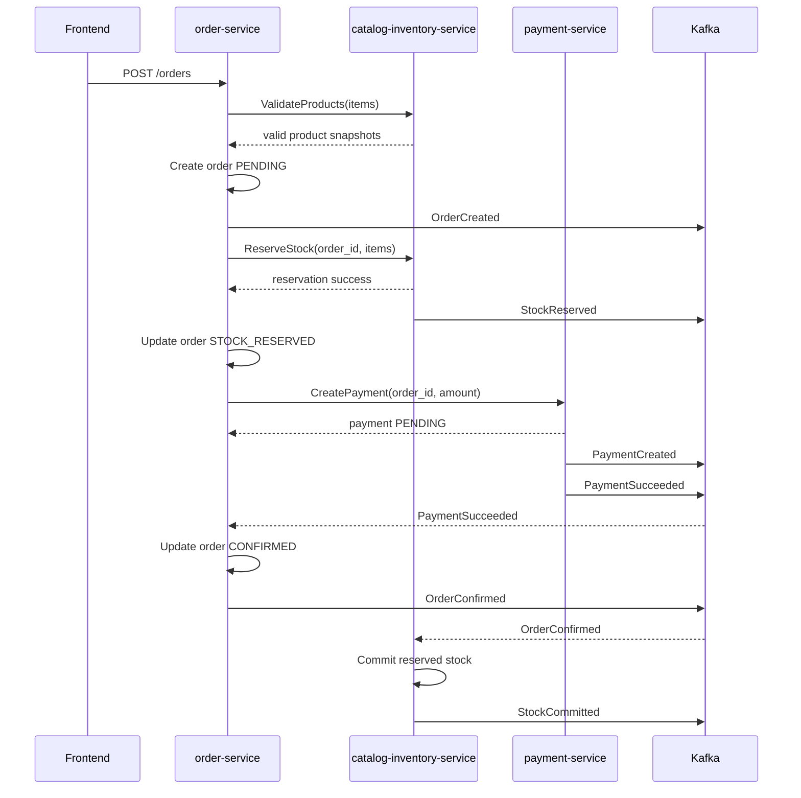
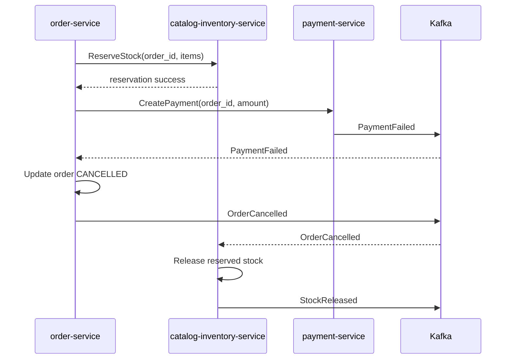
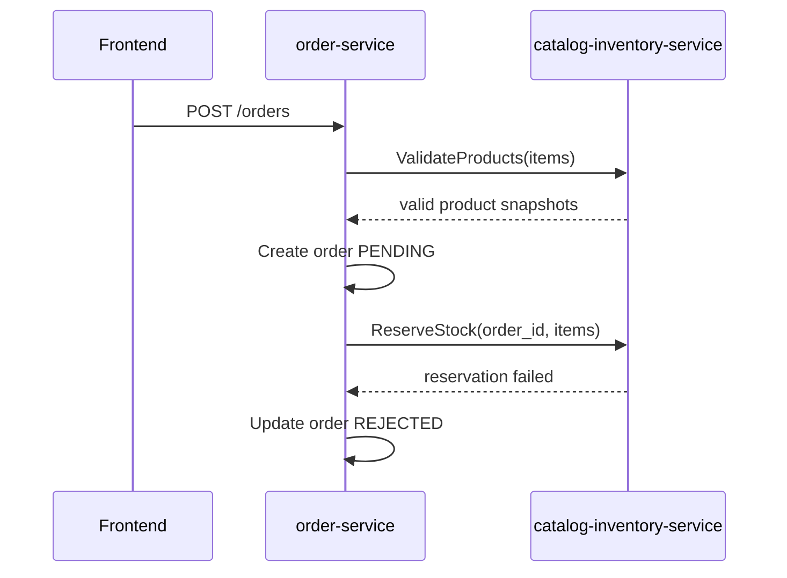
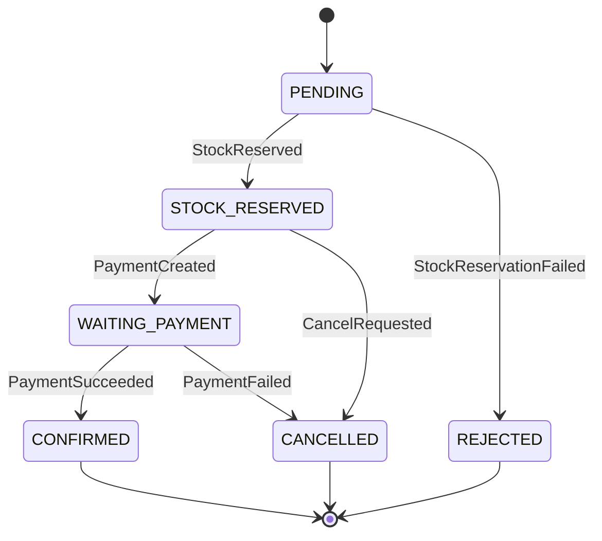

# Desain Checkout Saga

## 1. Pattern

Checkout flow menggunakan Saga Orchestration. Untuk demo/MVP, `order-service` menjadi Saga orchestrator karena transaction lifecycle berpusat pada order.

Orchestrator diimplementasikan sebagai module terpisah di dalam `order-service` agar nantinya bisa diekstrak menjadi dedicated service.

## 2. Happy Path



## 3. Payment Failed Path



## 4. Insufficient Stock Path



## 5. Saga Steps

| Step | Owner | Action | Success | Failure | Compensation |
| --- | --- | --- | --- | --- | --- |
| 1 | order-service | Validate products | Product snapshot dikembalikan | Reject request/order | Tidak ada |
| 2 | order-service | Create order | Order `PENDING` tersimpan | Return error | Tidak ada |
| 3 | catalog-inventory-service | Reserve stock | `StockReserved` | `StockReservationFailed` | Tidak ada |
| 4 | payment-service | Create/process payment | `PaymentSucceeded` | `PaymentFailed` | Release stock |
| 5 | order-service | Confirm order | `OrderConfirmed` | Retry update | Release stock jika confirmation tidak mungkin |
| 6 | catalog-inventory-service | Commit stock | `StockCommitted` | Retry event handling | Manual repair jika gagal permanen |

## 6. Order State Machine



## 7. Aturan Compensation

- Jika payment gagal setelah stock berhasil di-reserve, order harus mempublish `OrderCancelled`.
- `catalog-inventory-service` harus release reservation ketika mengonsumsi `OrderCancelled`.
- Releasing stock harus idempotent.
- Committing stock harus idempotent.
- Jika duplicate `PaymentFailed` dikonsumsi, order harus tetap `CANCELLED` dan tidak boleh ada efek duplicate `OrderCancelled`.

## 8. Idempotency

Key yang wajib:

- gRPC commands: `idempotency_key`
- Kafka events: `event_id`
- Saga instance: `saga_id`
- Business aggregate: `order_id`

Format idempotency key yang disarankan:

```text
{operation}:{order_id}:{step_name}
```

Examples:

- `reserve-stock:ord_123:checkout`
- `create-payment:ord_123:checkout`
- `release-stock:ord_123:payment-failed`

## 9. Timeout dan Retry

- gRPC call harus menggunakan timeout pendek.
- Transient gRPC failure dapat diretry dengan idempotency key yang sama.
- Kafka consumer harus retry transient failure.
- Poison message pada akhirnya harus dipindahkan ke dead-letter topic jika DLQ diimplementasikan.
- Saga yang stuck di `STOCK_RESERVED` atau `WAITING_PAYMENT` melewati timeout konfigurasi harus ditandai untuk repair atau cancellation.

## 10. Jalur Extraction

Ketika dedicated orchestrator diperkenalkan:

- Pindahkan saga state dan orchestration module ke `checkout-orchestrator-service`.
- `order-service` mempublish `OrderCreated`.
- Orchestrator mengonsumsi `OrderCreated`, memanggil inventory/payment, lalu mempublish `CheckoutCompleted` atau `CheckoutFailed`.
- `order-service` mengonsumsi checkout result event dan mengupdate order status.
