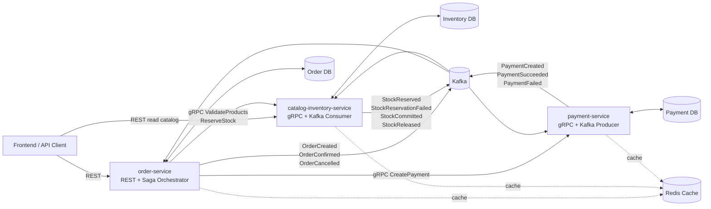

# System Architecture

## 1. Konteks

Sistem terdiri dari 3 backend microservices yang mendukung aplikasi mini toko bangunan:

- `order-service`
- `catalog-inventory-service`
- `payment-service`

Komunikasi menggunakan:

- REST untuk API yang dipanggil frontend.
- gRPC untuk komunikasi sinkron antar service.
- Kafka untuk domain event dan proses asinkron.

Implementasi menggunakan:

- Go.
- Hexagonal Architecture per service.
- PostgreSQL sebagai source of truth per service.
- Redis sebagai cache per service.

## 2. High-Level Diagram

## 3. Tanggung Jawab Service

### order-service

- Memiliki order lifecycle.
- Mengekspos checkout REST API.
- Mengorkestrasi checkout Saga.
- Menyimpan order status, order item, saga state, outbox, dan inbox.
- Memanggil inventory dan payment service menggunakan gRPC.
- Mengonsumsi payment event.
- Mempublish order event.
- Menggunakan Redis untuk short-lived order read cache dan optional idempotency/Saga locks.

### catalog-inventory-service

- Memiliki product, category, inventory, dan stock reservation.
- Mengekspos catalog read REST API untuk demo/frontend.
- Mengekspos inventory gRPC API untuk penggunaan internal.
- Melakukan commit atau release reserved stock berdasarkan order event.
- Mempublish inventory event.
- Menggunakan Redis untuk product, category, dan catalog read cache.

### payment-service

- Memiliki payment record dan payment attempt.
- Mengekspos payment gRPC API untuk penggunaan internal.
- Mensimulasikan payment success/failure.
- Mempublish payment event.
- Menggunakan Redis untuk short-lived payment status cache dan optional idempotency locks.

## 4. Aturan Komunikasi

- REST hanya digunakan untuk API yang menghadap frontend.
- gRPC digunakan untuk command/query internal yang membutuhkan response langsung.
- Kafka digunakan untuk domain event, state propagation, compensation trigger, dan audit trail.
- Service tidak boleh membaca database service lain.
- Service tidak boleh membaca Redis key milik service lain.
- Event adalah fakta yang sudah terjadi, bukan command.
- Command yang mengubah state harus membawa idempotency key.
- Redis bukan source of truth.
- Keputusan checkout kritikal harus berdasarkan state PostgreSQL, bukan cached stock.

## 5. Kafka Topics

| Topic | Producer | Consumer | Tujuan |
| --- | --- | --- | --- |
| `order.events` | order-service | catalog-inventory-service, payment-service | Event order lifecycle. |
| `inventory.events` | catalog-inventory-service | order-service | Hasil stock reservation/commit/release. |
| `payment.events` | payment-service | order-service | Event payment lifecycle. |

Kafka message key yang direkomendasikan:

- `order_id` for all checkout-related events.

## 6. Reliability Patterns

- Outbox pattern untuk event publishing.
- Inbox pattern untuk idempotent event consumption.
- Idempotency key untuk gRPC command yang mengubah state.
- Correlation ID untuk tracing satu checkout flow.
- OpenTelemetry trace context propagation melewati REST, gRPC, Kafka, PostgreSQL, dan Redis.
- Retry dengan backoff untuk transient failure.
- Dead-letter topic untuk poison message jika diimplementasikan.
- Cache-aside pattern untuk Redis read.
- Database-backed idempotency tetap wajib walaupun Redis lock digunakan.

## 7. Deployment Units

Setiap service harus dapat dideploy secara independen:

- Memiliki application container sendiri.
- Memiliki database/schema sendiri.
- Memiliki Redis key namespace sendiri.
- Memiliki migration lifecycle sendiri.
- Memiliki health endpoint sendiri.
- Memiliki log dan metric sendiri.

## 8. Evolusi Berikutnya

Untuk MVP/demo, checkout orchestration berada di dalam `order-service`. Jika workflow berkembang mencakup shipment, invoice, procurement, fraud check, loyalty, atau multi-warehouse fulfillment, module orchestration dapat diekstrak menjadi dedicated `checkout-orchestrator-service`.
