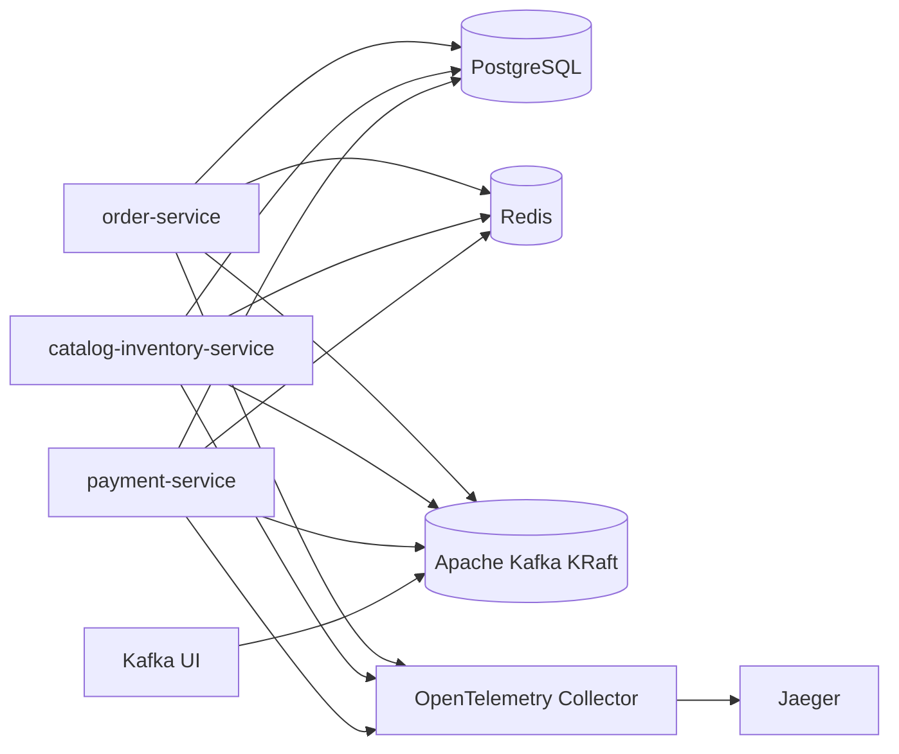

# Arsitektur Docker Compose

## 1. Tujuan

Dokumen ini mendefinisikan komponen yang akan dijalankan melalui `docker-compose.yml` untuk local development dan demo production-like.

## 2. Komponen

Docker Compose harus menyediakan:

```text
order-service
catalog-inventory-service
payment-service
postgres
redis
kafka
kafka-ui
otel-collector
jaeger
prometheus
grafana
cAdvisor
postgres-exporter
kafka-exporter
```

## 3. Diagram Local Runtime



## 4. Port Lokal

| Komponen | Internal | Host | Keterangan |
| --- | --- | --- | --- |
| order-service REST | `8080` | `8080` | API order/checkout |
| catalog-inventory-service REST | `8081` | `8081` | API catalog |
| order-service gRPC | `9000` | `9000` | Internal/debug |
| catalog-inventory-service gRPC | `9001` | `9001` | Internal/debug |
| payment-service gRPC | `9002` | `9002` | Internal/debug |
| PostgreSQL | `5432` | `5432` | Satu instance, tiga database |
| Redis | `6379` | `6379` | Cache |
| Kafka internal | `9092` | - | Container-to-container |
| Kafka host | `29092` | `29092` | Host-to-kafka |
| Kafka UI | `8080` | `8090` | UI topic/consumer group |
| OTEL Collector gRPC | `4317` | `4317` | OTLP gRPC |
| OTEL Collector HTTP | `4318` | `4318` | OTLP HTTP |
| Jaeger UI | `16686` | `16686` | Trace viewer |

Catatan:

- Jika port `8080` bentrok antara Kafka UI dan order-service, Kafka UI harus dipublish ke `8090`.
- Service Go di dalam container menggunakan `kafka:9092`.
- Tool dari host menggunakan `localhost:29092`.

## 5. PostgreSQL Layout

Untuk local murah dan sederhana, gunakan satu PostgreSQL instance dengan tiga database:

```text
order_db
inventory_db
payment_db
```

Aturan:

- Service hanya boleh connect ke database miliknya sendiri.
- Tidak ada cross-database join.
- Data ownership tetap dipertahankan walaupun instance PostgreSQL sama.

## 6. Kafka KRaft

Gunakan Apache Kafka dalam KRaft mode, tanpa Zookeeper.

Local configuration:

```text
KAFKA_BROKERS=kafka:9092
```

Host configuration:

```text
localhost:29092
```

Topic dapat dibuat otomatis saat startup untuk demo, tetapi untuk production-like lebih baik dibuat eksplisit melalui script:

```text
scripts/create-topics.sh
```

## 7. Healthcheck

Setiap service harus punya:

```text
GET /healthz
GET /readyz
```

Readiness harus mengecek:

- PostgreSQL connection;
- Kafka producer/consumer readiness jika berlaku;
- Redis connection sebagai warning/non-critical;
- gRPC downstream untuk `order-service`.

## 8. Makefile Target

Target minimum:

```text
make up
make down
make infra-up
make infra-down
make infra-logs
make infra-ps
make migrate
make seed
make order-run
make inventory-run
make payment-run
make order-test
make inventory-test
make payment-test
make test
make demo-success
make demo-payment-failed
make demo-insufficient-stock
make demo-duplicate-event
```

Target `infra-up` hanya menjalankan dependency infrastructure, bukan service aplikasi.

Tujuan:

- service dapat dijalankan dari IDE;
- debugging lebih mudah;
- restart service tidak perlu restart Kafka/PostgreSQL/Redis.

Contoh workflow:

```text
make infra-up
make inventory-run
make payment-run
make order-run
```

Untuk menjalankan semua service via Compose:

```text
make up
```

## 9. Urutan Startup

1. `postgres`
2. `redis`
3. `kafka`
4. `kafka-ui`
5. `otel-collector`
6. `jaeger`
7. `prometheus` / `grafana` jika profile observability aktif
8. migration dan seed
9. `catalog-inventory-service`
10. `payment-service`
11. `order-service`

## 10. Batasan

Docker Compose ini untuk local/demo, bukan high availability production.

Untuk cloud murah, topology yang sama dapat dijalankan di satu VPS, tetapi perlu tambahan:

- reverse proxy;
- TLS;
- backup PostgreSQL;
- restart policy;
- resource limit;
- log rotation.

## 11. Podman Lokal dan Docker VPS

Local development diasumsikan menggunakan Podman.

VPS boleh menggunakan Docker.

Makefile harus menggunakan variable:

```text
COMPOSE ?= podman compose
```

Override di VPS:

```text
make up COMPOSE="docker compose"
make infra-up COMPOSE="docker compose"
```

Aturan kompatibilitas:

- gunakan Compose service name untuk komunikasi antar container;
- hindari `container_name` agar scaling/debugging lebih fleksibel;
- hindari `host.docker.internal`;
- gunakan named volume untuk PostgreSQL/Kafka/Redis;
- untuk bind mount di Podman rootless + SELinux, gunakan `:Z` jika dibutuhkan;
- jangan memakai fitur Compose yang hanya spesifik Docker Swarm.
