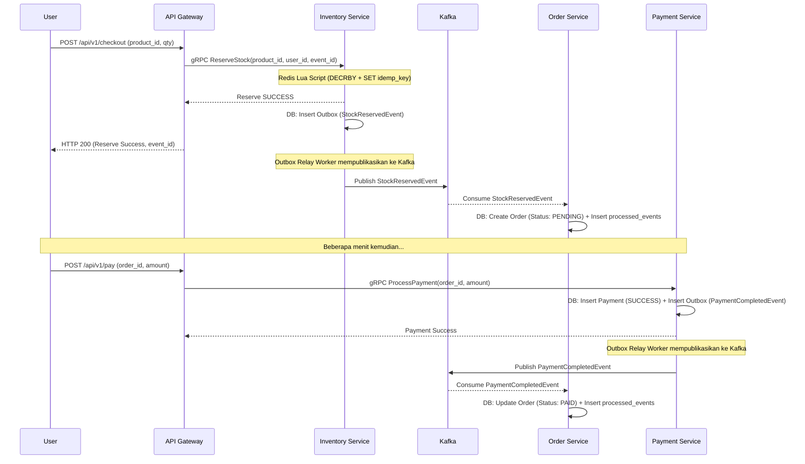
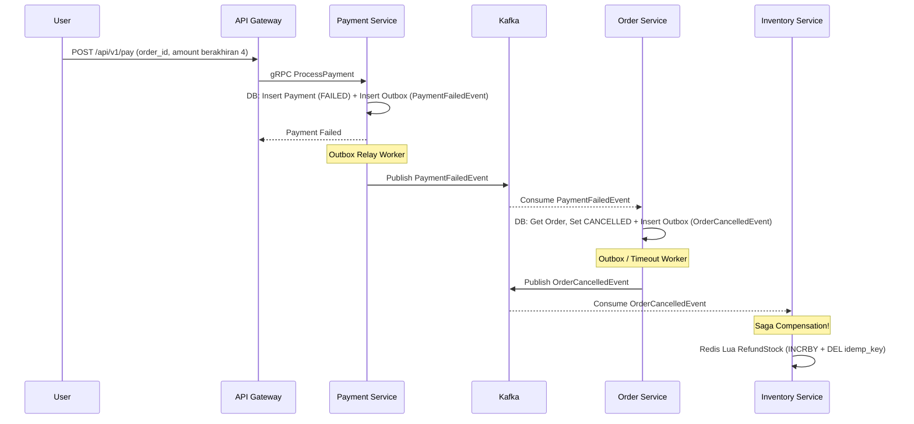
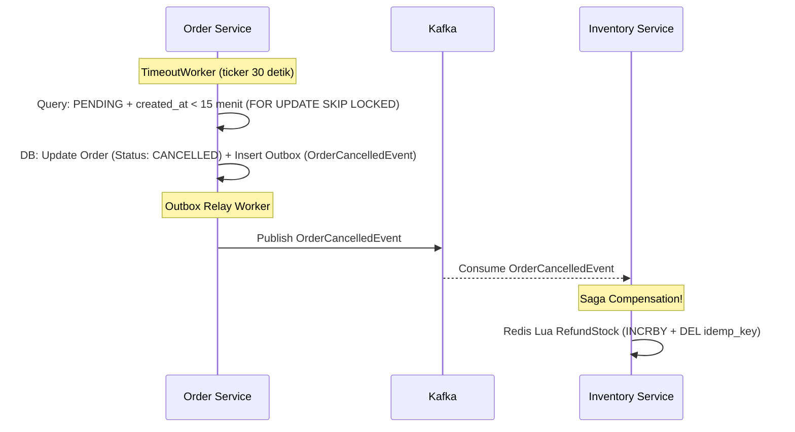

# Checkout Saga Design (Choreography)

Di dalam sistem *microservices*, satu transaksi bisnis (checkout) melintasi beberapa *service* (Inventory, Order, Payment). Kita tidak bisa menggunakan ACID Transactions biasa. Kita menggunakan **Saga Pattern**.

Untuk *Flash Sale*, kita menggunakan **Choreography-based Saga** berbasis Kafka. Setiap *service* memancarkan *event*, dan *service* lain bereaksi terhadap *event* tersebut.

## 1. Happy Path (Pesanan Sukses Dibayar)

## 2. Compensation Path: Pembayaran Gagal

Jika pembayaran ditolak (simulasi: `amount % 10 == 4`), Payment Service menerbitkan `PaymentFailedEvent`.

## 3. Compensation Path: Timeout (15 Menit)

Jika pengguna tidak membayar dalam waktu 15 menit, pesanan harus dibatalkan dan stok dikembalikan.

## 4. Aturan Idempotency (processed_events Table)
Sangat mungkin Kafka mengirimkan *event* yang sama dua kali (At-Least-Once Delivery).
- Setiap *consumer* harus mencatat `event_id` yang sudah diproses di tabel `processed_events`.
- Sebelum memproses *event*, service mengecek apakah `event_id` sudah ada. Jika sudah, abaikan (return success agar Kafka offset maju).
- Pengecekan dan insert dilakukan dalam satu transaksi SQL bersamaan dengan logika bisnis utama.

## 5. Transactional Outbox Pattern & Goroutine Poller Worker
Untuk menghindari hilangnya *event* saat mengirim ke Kafka, setiap *publisher* menyimpan *event* ke tabel `outbox_messages` terlebih dahulu bersamaan dengan transaksi *database* utama.
- Sebuah **Goroutine Poller Worker** berjalan di *background* setiap *service* produsen (Inventory Service dan Payment Service).
- Worker ini membaca baris `outbox_messages` dengan status `PENDING` menggunakan `FOR UPDATE SKIP LOCKED`, mengirimkannya ke Kafka via `franz-go`, lalu meng-*update* statusnya menjadi `SENT`. Jika gagal setelah 5 retry, statusnya menjadi `FAILED`.
