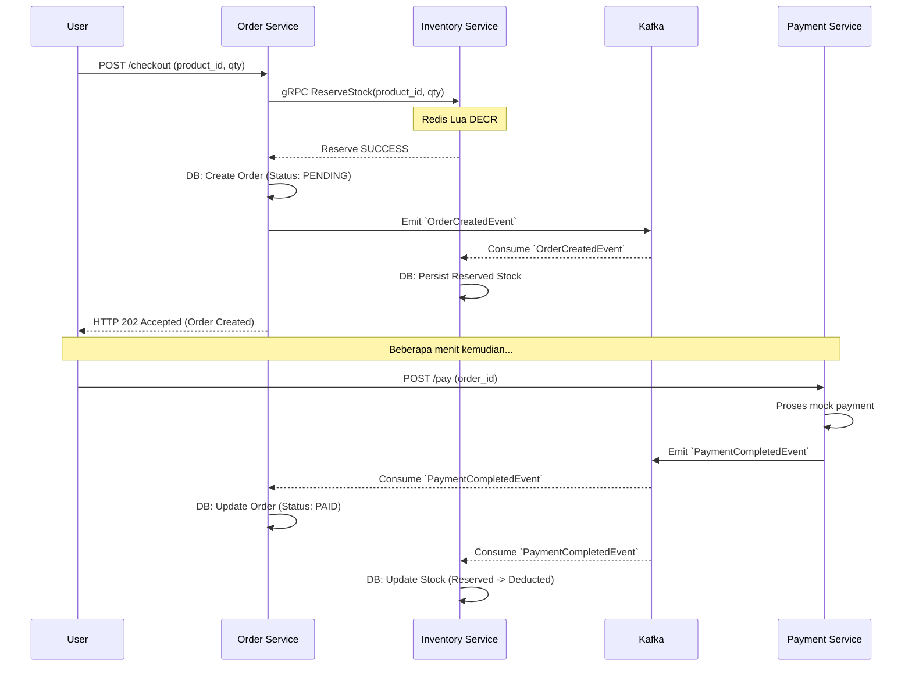
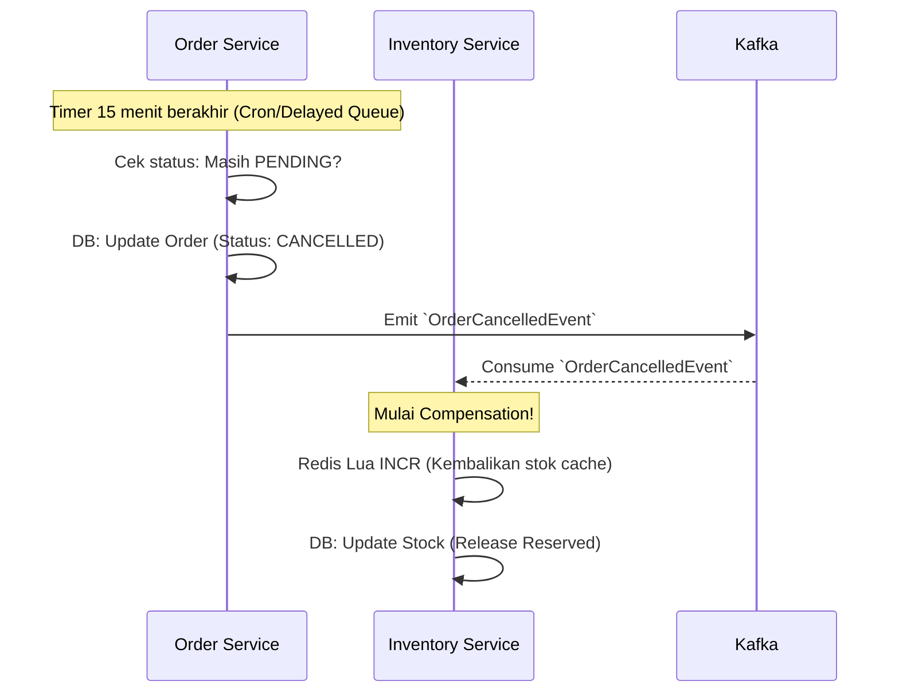

# Checkout Saga Design (Choreography)

Di dalam sistem *microservices*, satu transaksi bisnis (checkout) melintasi beberapa *database* (Inventory, Order, Payment). Kita tidak bisa menggunakan ACID Transactions biasa. Kita menggunakan **Saga Pattern**.

Untuk *Flash Sale*, kita menggunakan **Choreography-based Saga** berbasis Kafka. Setiap *service* memancarkan *event*, dan *service* lain bereaksi terhadap *event* tersebut.

## 1. Happy Path (Pesanan Sukses Dibayar)

## 2. Compensation Path (Gagal Bayar / Timeout)

Jika pengguna tidak membayar dalam waktu 15 menit, pesanan harus dibatalkan, dan stok di Redis serta Database harus dikembalikan (Rollback).

## 3. Aturan Idempotency
Sangat mungkin Kafka mengirimkan *event* yang sama dua kali.
- Setiap *consumer* harus mencatat `event_id` yang sudah diproses di sebuah tabel `processed_events`.
- Sebelum memproses event `PaymentCompletedEvent`, Order Service harus mengecek apakah `event_id` tersebut sudah ada di tabel `processed_events`. Jika sudah, abaikan *event* tersebut (*return success* ke Kafka agar *offset* maju).
