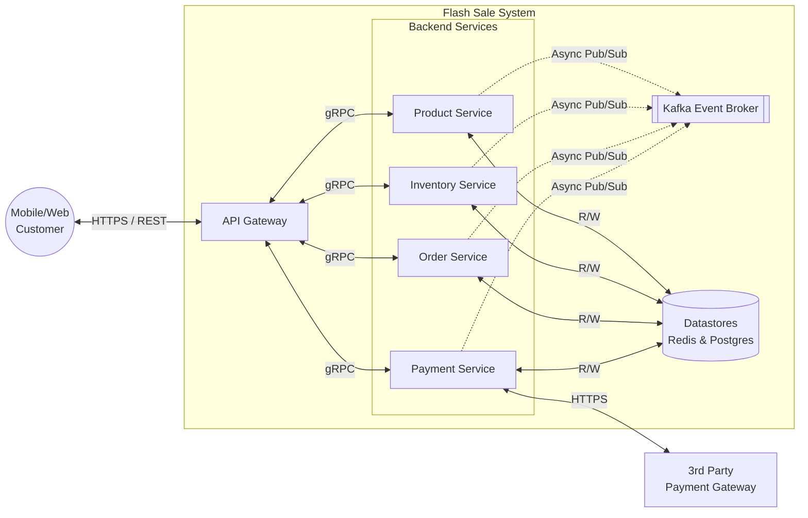
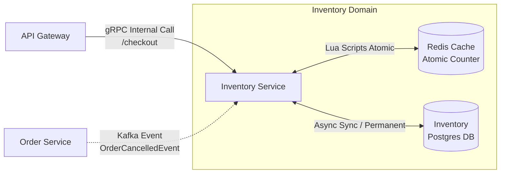
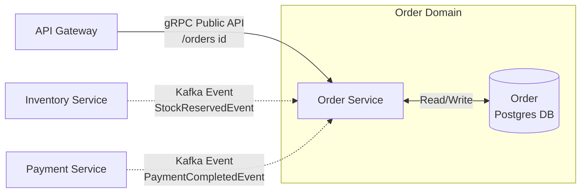
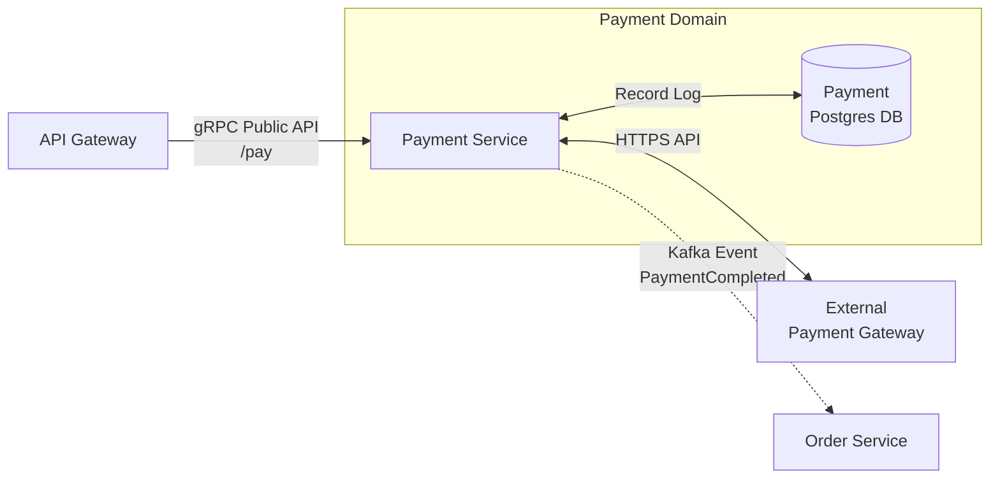
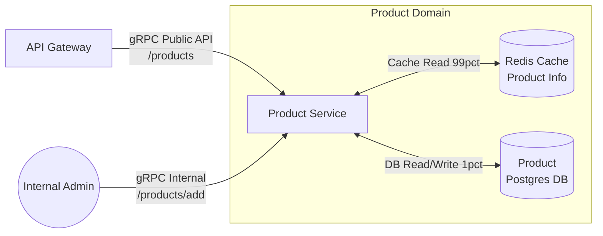

# Domain Context & Architecture Diagram

Dokumen ini memvisualisasikan batas domain (*domain boundaries*), aliran komunikasi, dan dependensi antar *microservices* dalam sistem Flash Sale. Pendekatan ini terinspirasi dari C4 Model (Container Level) dan Domain-Driven Design (DDD).

---

## 1. Top-Level System Architecture
Ini adalah pandangan "helikopter" dari seluruh sistem, menunjukkan bagaimana klien berinteraksi dengan API Gateway yang kemudian mendistribusikan beban ke layanan *backend*.

---

## 2. Identifikasi Domain: Inventory Service (The Core)
Inventory Service adalah layanan paling kritis. Diagram ini menunjukkan siapa yang memanggil layanan ini secara langsung (Public/Internal API) dan bagaimana ia berinteraksi dengan *storage*.

*Catatan:* Gateway melakukan pemanggilan internal gRPC secara sinkron untuk memotong stok di Redis. Jika sukses, Inventory menembakkan event ke Kafka.

---

## 3. Identifikasi Domain: Order Service
Order Service bertindak sebagai "buku catatan". Layanan ini sangat digerakkan oleh *event* (Event-Driven) dan jarang dipanggil untuk melakukan mutasi data secara sinkron.

*Catatan:* Order Service membuat baris pesanan `PENDING_PAYMENT` hanya ketika mendengar `StockReservedEvent` dari Inventory. Status berubah menjadi `PAID` ketika mendengar `PaymentCompletedEvent`.

---

## 4. Identifikasi Domain: Payment Service
Payment Service bertugas sebagai jembatan antara sistem internal dan Payment Gateway eksternal.

---

## 5. Identifikasi Domain: Product Service
Product Service adalah layanan *read-heavy* yang menampilkan katalog.

