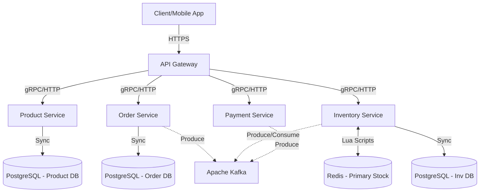

# System Architecture: Flash Sale Microservices

## 1. High-Level Component Diagram

Sistem terdiri dari beberapa komponen utama yang saling berinteraksi:

## 2. Penjelasan Microservices

1. **API Gateway**: 
   - Bertindak sebagai gerbang utama.
   - Bertanggung jawab atas *Rate Limiting* (menolak request jika RPS melebihi batas).
   - Melakukan Auth Check (verifikasi token JWT).

2. **Product Service**:
   - Hanya melayani operasi *Read* (GET produk).
   - Di-*cache* di Redis untuk menahan *read-heavy traffic*.

3. **Inventory Service (Paling Kritis)**:
   - Menyimpan *truth* ketersediaan barang selama *flash sale*.
   - Saat *flash sale* dimulai, *service* ini memotong stok langsung di **Redis** (bukan DB relasional) menggunakan operasi atomic.
   - Bertanggung jawab memancarkan (produce) `StockReservedEvent` ke Kafka atau menerima `OrderCancelledEvent` untuk mengembalikan stok.

4. **Order Service**:
   - Membuat pesanan. Tidak berani membuat pesanan sebelum mendapat kepastian stok.
   - Mendengarkan `StockReservedEvent` dari Inventory (atau menerima request via Saga), lalu menyimpan baris pesanan di database dengan status `PENDING_PAYMENT`.

5. **Payment Service**:
   - Memproses mock pembayaran. Jika berhasil, menembak `PaymentCompletedEvent`.

## 3. Aliran Data Utama (The Hit)

1. **Pre-heating**: Sebelum menit ke-0, Admin memanaskan Redis: `SET flashsale:product:99:stock 500`.
2. **Hit**: User memanggil `POST /order`.
3. Order Service / API Gateway memanggil gRPC ke Inventory Service.
4. Inventory Service menjalankan Lua Script di Redis: 
   - Cek stok > 0.
   - Jika ya, `DECR` stok, return `SUCCESS`.
5. Jika `SUCCESS`, kirim ke Kafka. Kembalikan 202 Accepted ke user.

## 4. Keputusan Arsitektur Kunci
- **Database per Service**: Masing-masing service memiliki *schema* atau *database* terpisah. Tidak boleh ada *cross-db join*.
- **Event-Driven**: Menggunakan Kafka untuk mengurai *coupling* dan me-*load-leveling* tulis ke database agar DB tidak hancur saat ribuan pesanan masuk.
